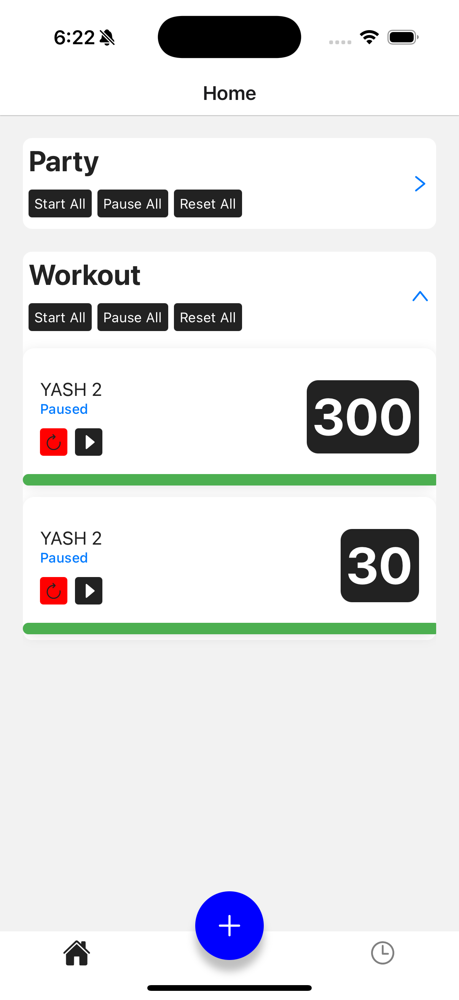
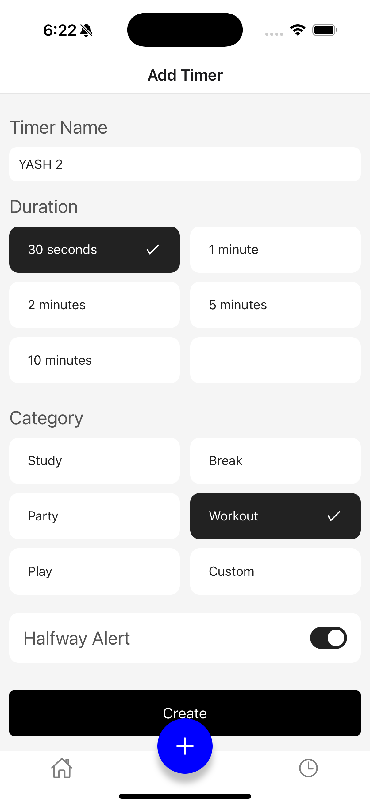
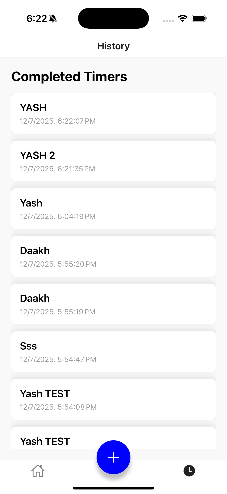

# ⏱️ Timer App (React Native + Expo)

A modern timer application built with **React Native**, using **Expo**, with features like category grouping, duration selection, halfway alerts, and a minimalistic bottom-tab UI.

---

## 📱 Screenshots

| Home Screen | Create Timer | History |
|-------------|--------------|---------|
|  |  |  |

---

## 🚀 Features

- ⌛ Create custom or predefined timers
- 📂 Group timers by category (e.g. Study, Break, Custom)
- ⏰ Set timer durations using presets or custom inputs
- 🟡 Halfway alert toggle
- ▶️ Start / ⏸ Pause / 🔄 Reset for individual timers
- 🧠 "Start All", "Pause All", and "Reset All" per category
- ⬇️ Expand/collapse timer groups
- 🌙 Clean, modern UI with dark-on-white and white-on-dark styling
- ⚙️ Platform compatibility for Android and iOS (Expo Go or standalone build)

---

## 📦 Tech Stack

- ⚛️ React Native (via Expo)
- 🔁 React Navigation (Bottom Tabs)
- 📦 Context API for global state management
- 📱 React Native Vector Icons (AntDesign, Ionicons)
- 💾 (Optional) AsyncStorage for persistence

---

## 🛠️ Setup Instructions

### 1. Prerequisites

- Node.js installed
- `expo-cli` globally installed:  
  ```bash
  npm install -g expo-cli
